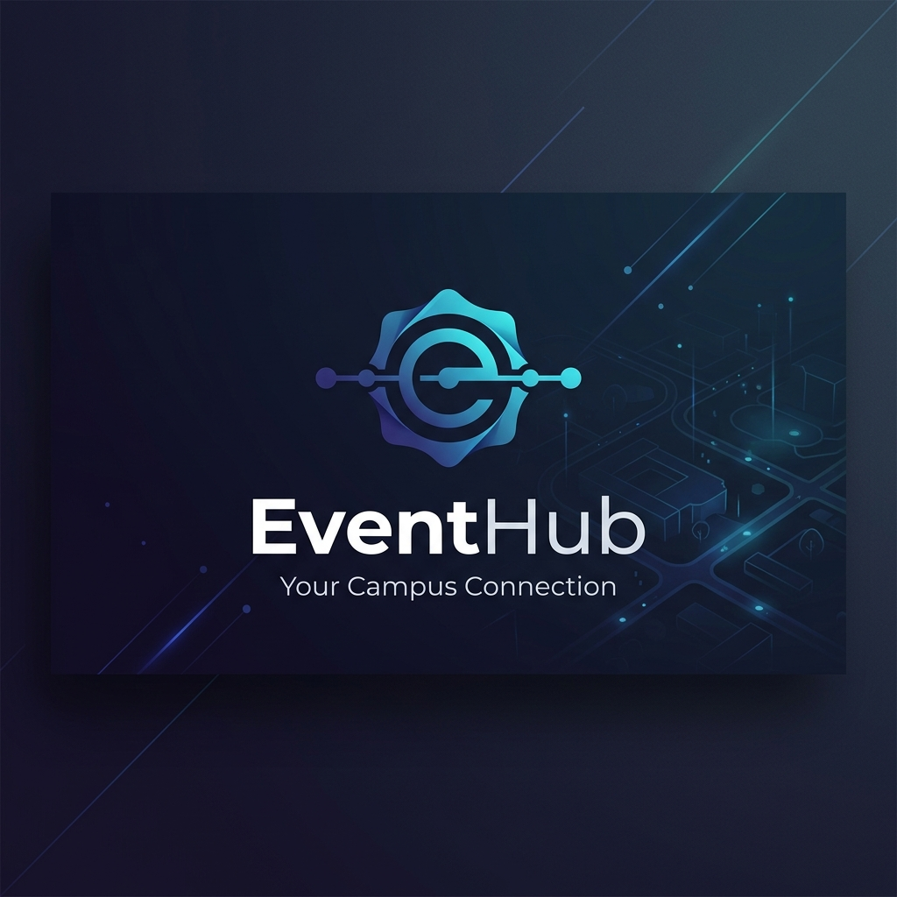

# EventHub - Smart Campus Event Scheduler & Engagement Platform



EventHub is a next-generation campus event scheduling and student engagement platform. It empowers student organizations to coordinate clash-free timelines, maximize event participation, and explore collaboration opportunities using data-driven insights.

---

## 🎯 Problem Statement
In university environments, coordinating events across numerous student clubs is highly chaotic:
1. **Schedule Clashes**: Multiple clubs frequently host workshops or auditoriums on the same day/hour, splitting student turnout and diluting engagement.
2. **University Blackouts**: Events are inadvertently scheduled during mid-semester exams, project submissions, or holidays, leading to zero attendance.
3. **Collaboration Blind Spots**: Clubs lack visual tools or data metrics to identify other student organizations with similar student interests, missing opportunities for joint hackathons or cultural festivals.
4. **Student Attendance Drop**: A lack of centralized tracking, scheduling visibility, and engagement incentives leads to declining event participation.

EventHub solves this by introducing a **Conflict Resolution Engine** for smart date suggestions, a **2-Hour Separation Validation** for event creations, and an **Overlap-Based Club Collaboration Suggester** connected directly to student registrations.

---

## 💻 Tech Stack
- **Framework**: [Next.js](https://nextjs.org/) (App Router & React 19)
- **Database**: [PostgreSQL](https://www.postgresql.org/) (hosted on Supabase)
- **ORM**: [Prisma](https://www.prisma.io/)
- **Styling**: TailwindCSS (v4) & Radix UI (Glassmorphic dark theme)
- **Icons**: Lucide React
- **Language**: TypeScript

---

## 🚀 Current Progress & Features (Mid-Evaluation)
The project has completed its core database design, full role separation, and algorithmic validations:

### 1. Separate Student & Club Roles
We separated user capabilities to ensure clean access permissions:
- **Student Mode**: Can browse upcoming timeline events, RSVP to earn points (+10 pts per registration), track personal calendars, and view the campus-wide XP Leaderboard.
- **Club Mode**: Can register new clubs, schedule events, browse attendee counts/rosters, and search for active collaborator clubs.
- **Route Guards**: Added server-side validation to redirect students trying to access administrative pages or clubs trying to view personal student schedules.

### 2. Timezone-Agnostic "Suggest Best Dates" Engine
- Iterates over the next 45 days in the school's local timezone (`Asia/Kolkata`) using string-only comparisons to avoid UTC offset shifts.
- Performs automated lookups against seeded academic calendar exams/holidays to disqualify blackout slots instantly.
- Penalizes dates with pre-existing events (`-20 pts` per clash) and rewards weekend prime slots (`+20 pts` on Fridays/Saturdays) to find the absolute best days.

### 3. Enforced 2-Hour Event Gap Validation
- When scheduling an event, the system parses dates using the local standard offset (`+05:30`).
- Checks the database and blocks scheduling if any other event is registered on campus within 2 hours of the proposed slot, returning details on which club event is clashing.

### 4. Overlap-Based Club Collaboration Suggester
- Analyzes RSVP overlaps to identify clubs sharing similar audiences.
- Displays recommendations (e.g. *Music Club shares 2 active students*) under a dedicated "Collaboration Insights" section on club dashboards to facilitate co-hosted events.

---

## 🗺️ Repository Structure & Mapping
EventHub follows the Next.js App Router workspace layout. Its modules map onto the recommended evaluation format as follows:

```
club-event-platform/
├── assets/                     # [ASSETS] Branding images, logos, banners
├── docs/                       # [DOCS] Architecture manuals and REST APIs guides
├── prisma/                     # [MODELS] Prisma Schema & PostgreSQL migrations
├── app/                        # [BACKEND/FRONTEND] App Route layout
│   ├── actions/                # [BACKEND] Server Actions (suggest-dates, event-actions)
│   ├── api/                    # [BACKEND] REST API Routes (session, role, collab)
│   ├── create/                 # [FRONTEND] Event creation view
│   ├── clubs/                  # [FRONTEND] Clubs grid view
│   ├── my-events/              # [FRONTEND] Personal schedule view
│   └── leaderboard/            # [FRONTEND] Student ranking view
├── components/                 # [FRONTEND] Reusable React UI elements (RoleSwitcher, etc.)
└── scripts/                    # [SCRIPTS] Database reseeding and integration tests
```

---

## 📋 Planned Features (Next Steps)
1. **Interactive Calendar Overlay**: Replace raw inputs with a full interactive calendar dashboard highlighting exam slots and recommendation scores visually.
2. **Co-Hosting Requests**: Add an invite system directly inside the Collaboration suggester allowing clubs to send co-hosting invites to suggested partners.
3. **Auditorium Booking integration**: Link date recommendations to specific campus rooms, checking room capacity and booking conflicts simultaneously.
4. **Push Notifications**: Introduce email or system notifications alerting students of newly scheduled events and RSVP reminders.

---

## 🛠️ Setup & Running Instructions

### Prerequisites
- Node.js (v20+ recommended)
- PostgreSQL database URL (configured in `.env`)

### Installation & Run
1. **Clone the repository**:
   ```bash
   git clone <repository-url>
   cd club-event-platform
   ```
2. **Install dependencies**:
   ```bash
   npm install
   ```
3. **Set up environment variables**:
   Create a `.env` file in the root based on `.env.example`:
   ```env
   DATABASE_URL="postgresql://..."
   DIRECT_URL="postgresql://..."
   ```
4. **Push schema to database**:
   ```bash
   npm run db:push
   ```
5. **Seed academic calendar**:
   POST to `/api/seed` using curl or your browser:
   ```bash
   curl -X POST http://localhost:3000/api/seed
   ```
6. **Launch Development Server**:
   ```bash
   npm run dev
   ```
   Open [http://localhost:3000](http://localhost:3000) to view the application.
