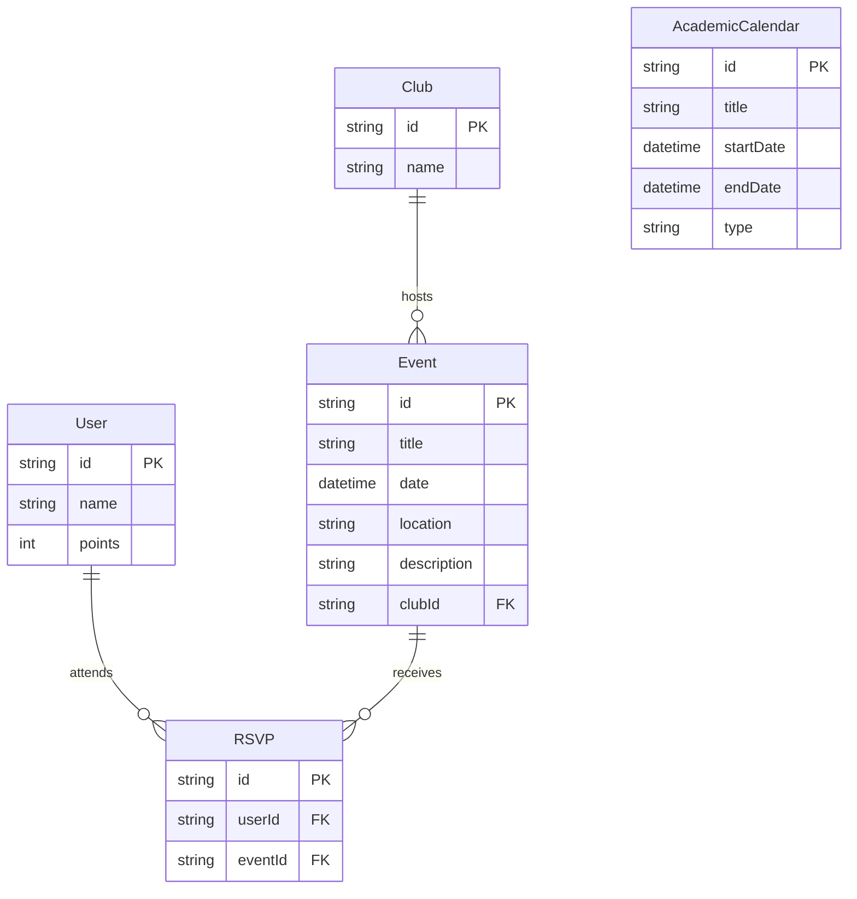

# System Architecture - EventHub

EventHub is designed as a unified full-stack application built on top of Next.js and Prisma. Below is the architectural breakdown and structure mapping.

---

## 🏛️ Directory Structure Mapping

To maintain compatibility with Next.js App Router (which enforces file-system routing), the repository uses a unified structure where frontend and backend are cleanly segmented inside folders:

```
club-event-platform/
├── assets/                     # UI Banners, Logos, and Media Assets
│   └── eventhub_logo_banner.png
├── docs/                       # Technical Documentation & Architecture Manuals
│   ├── architecture.md
│   └── api-guide.md
├── app/                        # Next.js Unified Workspace
│   ├── page.tsx                # Frontend: Home Event Timeline
│   ├── layout.tsx              # Frontend: Root & Shared Persistent Layout Frame
│   ├── actions/                # Backend: Server Actions (suggestBestDates, createEventAction, rsvpToEvent)
│   ├── api/                    # Backend: REST API Routes (session, club-session, role, clubs, users, collab)
│   ├── create/                 # Frontend: Create Event page (Club Mode)
│   ├── clubs/                  # Frontend: Clubs Directory (Club Mode)
│   ├── my-events/              # Frontend: My Schedule page (Student Mode)
│   └── leaderboard/            # Frontend: Leaderboard (Student Mode)
├── components/                 # Frontend Reusable React UI Components
│   └── dashboard/              # Sidebar, Header, RoleSwitcher, EventFeed, CollabSuggester, Selectors
├── prisma/                     # Database Models (PostgreSQL & Prisma Schema)
│   └── schema.prisma
├── lib/                        # Shared Utilities & Session Handlers
│   ├── prisma.ts               # Prisma PgClient adapter pooler
│   └── auth.ts                 # Session and active-role cookie parsers
└── scripts/                    # Database seeding and integration test suites
```

---

## 🔒 Session & Role Separation Framework

Authentication and mode selection are cookie-bound and parsed on both the client (via fetch handlers) and server (via Server Components/Actions):

- **Role Switcher**: Toggles between `Student Mode` and `Club Mode`, modifying the `active-role` cookie.
- **Sidebar & Header**: Adapts navigation items dynamically and renders either the `UserSelector` (Student) or the `ClubSelector` (Club).
- **Route Guards**: Evaluates the `active-role` cookie in page components. Unauthorized visits are instantly redirected to `/` using `redirect("/")`.

---

## 💾 Database Model Entity Relationships

Built using Prisma and PostgreSQL:


